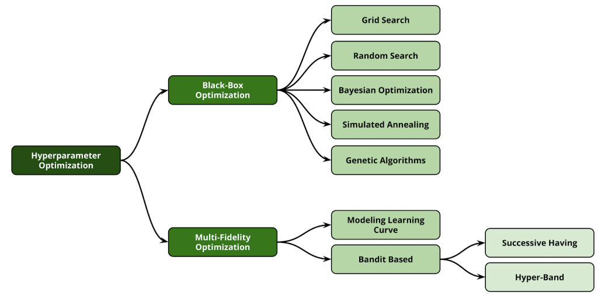

# Optimización Bayesiana (BO)
# (MCD ITAM Otoño 2024)

Repositorio para una proyecto final de la materia de Métodos Numericos y Optimización 

## Autor

| Nombre                        |  CU    | Correo Electrónico             | Usuario Github |
|-------------------------------|--------|--------------------------------|----------------|
| Yuneri Pérez Arellano         | 199813 | yperezar@itam.mx               | YunPerez       |
| Thomas Rudolf         | 169296| xxxxx@itam.mx               | ThMRudolf      |
| Blanca E. García Manjarrez | 118886 | bgarci11@itam.mx   |    BGARCIAMA   |
| Sofia Gerard | 149721 | sgerardr@itam.mx   |    sofiagerard   |


# Contexto  🧠
En el ámbito de la ciencia de datos y el aprendizaje automático, la selección de hiperparámetros desempeña un papel crucial para garantizar el desempeño óptimo de los modelos predictivos. Los hiperparámetros, a diferencia de los parámetros internos de un modelo, son configuraciones que deben definirse antes del proceso de entrenamiento y que afectan directamente la capacidad del modelo para generalizar, es decir, aprender patrones complejos y evitar problemas como el sobreajuste o el subajuste. 
Tradicionalmente, las técnicas como la búsqueda en cuadrícula (Grid Search) o la búsqueda aleatoria (Random Search) han sido ampliamente utilizadas para esta tarea. Sin embargo, su naturaleza exhaustiva o aleatoria las hace poco eficientes, especialmente en escenarios donde el espacio de búsqueda es vasto o los recursos computacionales son limitados.

La optimización bayesiana ha emergido como una metodología eficiente y efectiva para abordar el problema de la selección de hiperparámetros. Esta técnica combina principios probabilísticos y de optimización para modelar de manera iterativa el espacio de búsqueda, utilizando un enfoque basado en la exploración y explotación de las configuraciones más prometedoras. Al construir un modelo probabilístico del rendimiento del modelo en función de los hiperparámetros, la optimización bayesiana permite identificar de manera más estratégica aquellos conjuntos de hiperparámetros que maximizan o minimizan una métrica objetivo, como la pérdida logarítmica, la exactitud o cualquier otra medida de desempeño.


# Objetivo del proyecto  🎯

Este proyecto se enfoca en explorar la aplicación de la optimización bayesiana para la búsqueda de hiperparámetros en modelos de aprendizaje automático. A través de una combinación de métodos numéricos, técnicas de optimización y herramientas avanzadas como Gaussian Processes, Tree-structured Parzen Estimators (TPE) o modelos basados en redes neuronales, se busca evaluar cómo esta técnica mejora la eficiencia y el rendimiento en comparación con enfoques tradicionales. Además, se analizarán los beneficios, desafíos y limitaciones inherentes a su implementación, proporcionando un marco de referencia para la selección óptima de hiperparámetros en proyectos de machine learning y deep learning.



# Base de datos  ✍

Se empleo el [conjunto de datos de diabetes de sklearn](https://scikit-learn.org/stable/modules/generated/sklearn.datasets.load_diabetes.html#sklearn.datasets.load_diabetes).

# Infraestructura y Ejecución  ⚙

## Requerimientos de Software herramientas recomendadas

1. [Cuenta de Github](https://github.com)
2. [VSCodeIDE](https://code.visualstudio.com/)

Para ejecutar este producto de datos se necesita lo siguiente:
- Sistema operativo Linux/Mac/Windows.
- Clonar el repositorio en el equipo.
- Activar el entorno virtual, corriendo la siguiente línea de comando en la terminal:
  ```bash
  conda env create --file environment.yml / environment_tf.yml (para activar tensorflow)
  conda activate BayesianOptimization
  ```
- Correr los scripts en el siguiente orden:
  1. Optimizacion_Bayesiana_2024.ipynb

## Estructura del repositorio  📂


Fuentes:

- https://krasserm.github.io/2018/03/21/bayesian-optimization/
- https://peepdata.github.io/-hyperparameter-optimization-hyperband/
- https://lucasezamora.medium.com/hyperparameter-optimization-con-hyperband-7a2ca6c4d341
- https://medium.com/latinxinai/automatizando-la-selecci%C3%B3n-de-modelos-y-el-ajuste-de-hiperpar%C3%A1metros-con-gridsearchcv-0ef095828cb8
